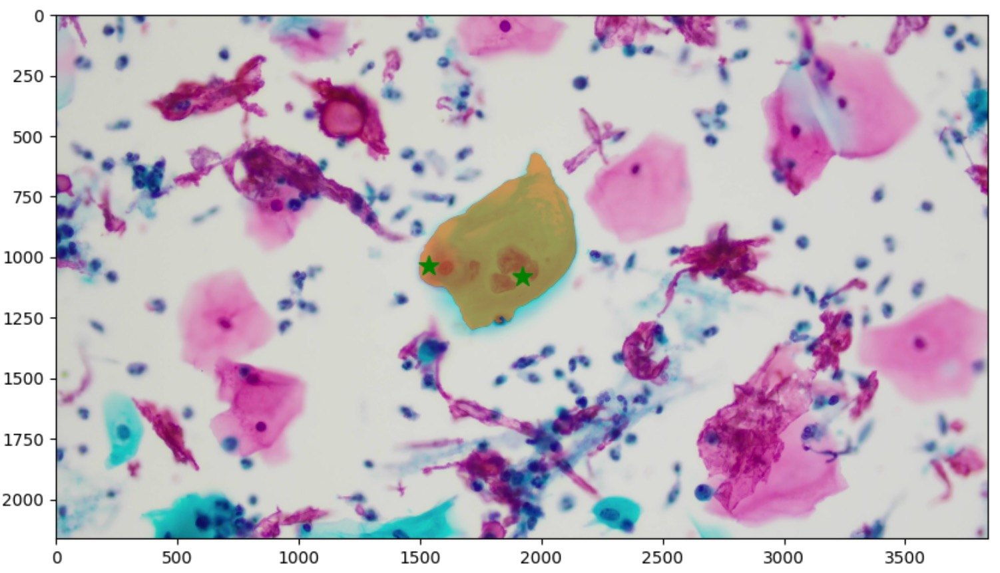
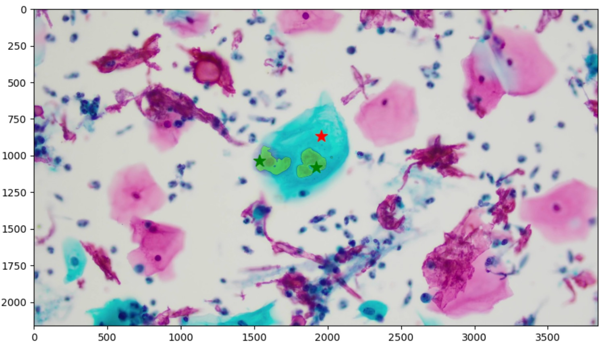
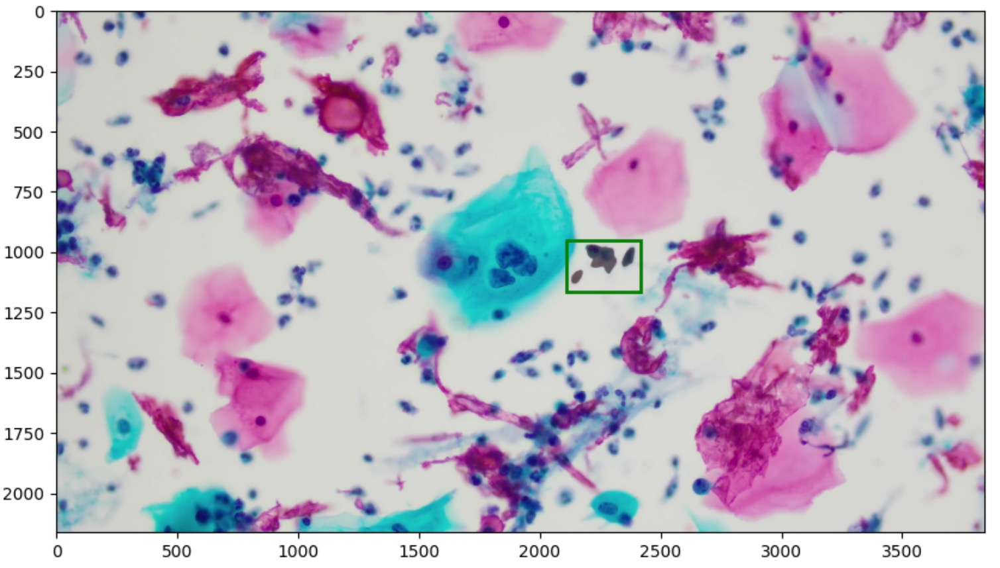
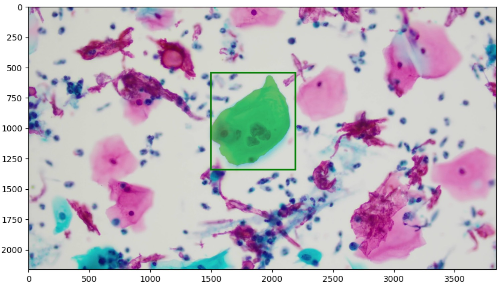

# mdi-ml-sam
MDI标注平台 SAM实时识别server⚡️。
当前支持:
- 1.🌟实时标注:多点标注，单矩形标注.
- 2.🔥带不同positive和negative的prompt.
<p float="left">
  <strong>point模式</strong>
  <br>
  
  

  <strong>rectangle模式</strong>

  
  
  
</p>


+ 支持模型:
  - 1.**[Meta原生SAM](https://github.com/facebookresearch/segment-anything)** (服务默认)
  - 2.**[mobile_sam](https://github.com/ChaoningZhang/MobileSAM)**
  - 3.**ONNX**模式
## Installation
本版本开发过程中的Python为3.10.12，请使用此版本或者更新的版本。
# 接口文档
+ 说明:请求体采用json方式，请求头中包含token进行验证 
请求头:Content-Type:application/json;token:xxxx
## 1.predict
- 接口说明: 使用sam模型获取指定url图片位置的mask。如果url中的图片未经过preload **下载&加载图片进入模型**，届时将增加一定时耗。可先调用preload接口 **下载&加载图片进入模型**。
- method: **POST**
- URL: ```${prefix_url}/predict```
- body

参数名|类型|出现要求|描述
---|---|---|---
[tasks](#tasks参数)|json|是|指定的图片
model_version|string|否|sam模型类型,默认使用sam_vit_l
task_id|string|是|任务id，用来区别不同task
[params](#params参数)|json|是|参数

### tasks参数
```shell
{
    "tasks": [
        {
            'data': {
                'image': 'https: //s3.amazonaws.com/htx-pub/datasets/images/125245483_152578129892066_7843809718842085333_n.jpg'
            }
        }
    ]
}
```

### params参数

```shell
#keypoint 点模式:
{   "login": null,
    "password": null,
    "context": {
        "result": [
            {
                "original_width": 3840,
                "original_height": 2160,
                "image_rotation": 0,
                "value": {
                    "x": 80.3072625698324,
                    "y": 43.67245657568238,
                    "width": 0.27932960893854747,
                    "keypointlabels": ["Banana"]
                },
                "is_positive": true,
                "type": "keypointlabels", //类型1:keypointlabels点标注,2:rectanglelabels方框标注
                "origin": "manual"
            },
            
        ]
    }
}

#rectangle 矩形模式:
{
    "login": null,
    "password": null,
    "context": {
        "result": [
            {
                "original_width": 3840,
                "original_height": 2160,
                "image_rotation": 0,
                "value": {
                    "x": 55,
                    "y": 44,
                    "width": 8,
                    "height": 10,
                    "rectanglelabels": [
                        "Banana"
                    ]
                },
                "type": "rectanglelabels",
                "origin": "manual"
            }
        ]
    }
}

```
### request
Headers:
Content-Type:application/json;token:test
### response
```shell
{
    "results": [
        {
            "model_version": "SAM:../model/sam_vit_b_01ec64.pth:cuda",
            "result": [
                {
                    "id": "6386",
                    "image_rotation": 0,
                    "original_height": 2160,
                    "original_width": 3840,
                    "readonly": false,
                    "score": 0.7328885197639465,
                    "type": "brushlabels",
                    "value": {
                        "bbox": [
                            1501,
                            570,
                            642,
                            730
                        ],
                        "brushlabels": [
                            "Banana"
                        ],
                        "format": "rle",
                        "rle": [
                            ...
                            ]
                    }
                }
            ]
        }
    ]
}
```
### 演示
#### 1.keypoints prompt
此图传入了3个点，其中2个是positive，1个是negtive.
+ request
```shell
{
    "tasks": [
        {
            "data": {
                "image": "https://img.ibingli.cn/signature/CMWGTUhghiTnTpwd.jpg"
            }
        }
    ],
    "model_version": "mobile_sam",
    "task_id": 1,
    "params": {
        "login": null,
        "password": null,
        "context": {
            "result": [
                    {
                    "original_width": 3840,
                    "original_height": 2160,
                    "image_rotation": 0,
                    "value": {
                        "x": 50,
                        "y": 50,
                        "width": 0.3189792663476874,    
                        "keypointlabels": ["Banana"]
                    },
                    "is_positive": true,
                    "type": "keypointlabels",
                    "origin": "manual"
                },
                {
                    "original_width": 3840,
                    "original_height": 2160,
                    "image_rotation": 0,
                    "value": {
                        "x": 44,
                        "y": 50,
                        "width": 0.3189792663476874,    
                        "keypointlabels": ["Banana"]
                    },
                    "is_positive": true,
                    "type": "keypointlabels",
                    "origin": "manual"
                },
                {
                    "original_width": 3840,
                    "original_height": 2160,
                    "image_rotation": 0,
                    "value": {
                        "x": 50,
                        "y": 40,
                        "width": 0.3189792663476874,    
                        "keypointlabels": ["Banana"]
                    },
                    "is_positive": false,
                    "type": "keypointlabels",
                    "origin": "manual"
                }
            ]
        }
    }
}
```
+ response
```shell
{
    "results": [
        {
            "model_version": "SAM:../model/sam_vit_b_01ec64.pth:cuda",
            "result": [
                {
                    "id": "8c11",
                    "image_rotation": 0,
                    "original_height": 2160,
                    "original_width": 3840,
                    "readonly": false,
                    "score": 0.8481563925743103,
                    "type": "brushlabels",
                    "value": {
                        "bbox": [
                            1574,
                            952,
                            462,
                            198
                        ],
                        "brushlabels": [
                            "Banana"
                        ],
                        "format": "rle",
                        "rle": [
                            ...
                        ]
                    }
                }
            ]
        }
    ]
}
```
效果:
<p float="left">
  
</p>

#### 2.rectangle prompt
传入一个矩形，进行分割识别。
+ request
```shell
{
    "tasks": [
        {
            "data": {
                "image": "https://img.ibingli.cn/signature/CMWGTUhghiTnTpwd.jpg"
            }
        }
    ],
    "model_version": "sam",
    "task_id": 1,
    "params": {
        "login": null,
        "password": null,
        "context": {
            "result": [
                    {
                    "original_width": 3840,
                    "original_height": 2160,
                    "image_rotation": 0,
                    "value": {
                        "x": 55,
                        "y": 44,
                        "width": 8,
                        "height": 10,
                        "rectanglelabels": ["Banana"]
                    },
                    "type": "rectanglelabels",
                    "origin": "manual"
                }
            ]
        }
    }
}
```
+ response
```shell
{
    "results": [
        {
            "model_version": "SAM:../model/sam_vit_b_01ec64.pth:cuda",
            "result": [
                {
                    "id": "4a26",
                    "image_rotation": 0,
                    "original_height": 2160,
                    "original_width": 3840,
                    "readonly": false,
                    "score": 0.8841575980186462,
                    "type": "brushlabels",
                    "value": {
                        "bbox": [
                            2131,
                            968,
                            262,
                            162
                        ],
                        "brushlabels": [
                            "Banana"
                        ],
                        "format": "rle",
                        "rle": [
                            ...
                        ]
                    }
                }
            ]
        }
    ]
}        
```

效果图
<p float="left">
  
</p>

## 2.preload 
- 接口说明:在使用sam模型进行自动标注前，前端加载过程中，可调用后端提前**下载&加载图片进入模型**。
- method:**POST,GET**
- URL:```${prefix_url}/preload```
- body

参数名|类型|出现要求|描述
---|---|---|---
url|string|是|需要预下载图片的url
task_id|string|是|任务id

### request
Headers:
Content-Type:application/json;token:test
```
{
  "url":"xxxx",
  "task_id":"xxxx"
}
```
### response
```
{
    "code": 200,
    "msg": "ok"
}
```
## 3.health
method: **GET**
URL:```${prefix_url}/health```

### request
Headers:
Content-Type:application/json;token:test
### response
```
{
    "code": 200,
    "model_class": "SamMLBackend",
    "msg": "ok"
}
``````
