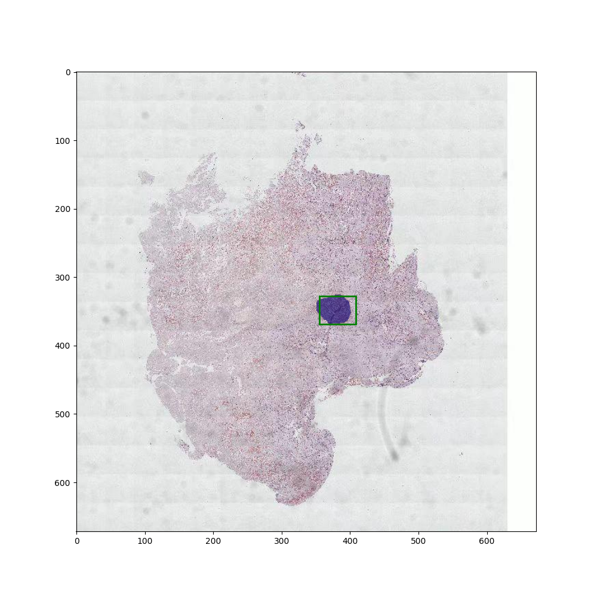
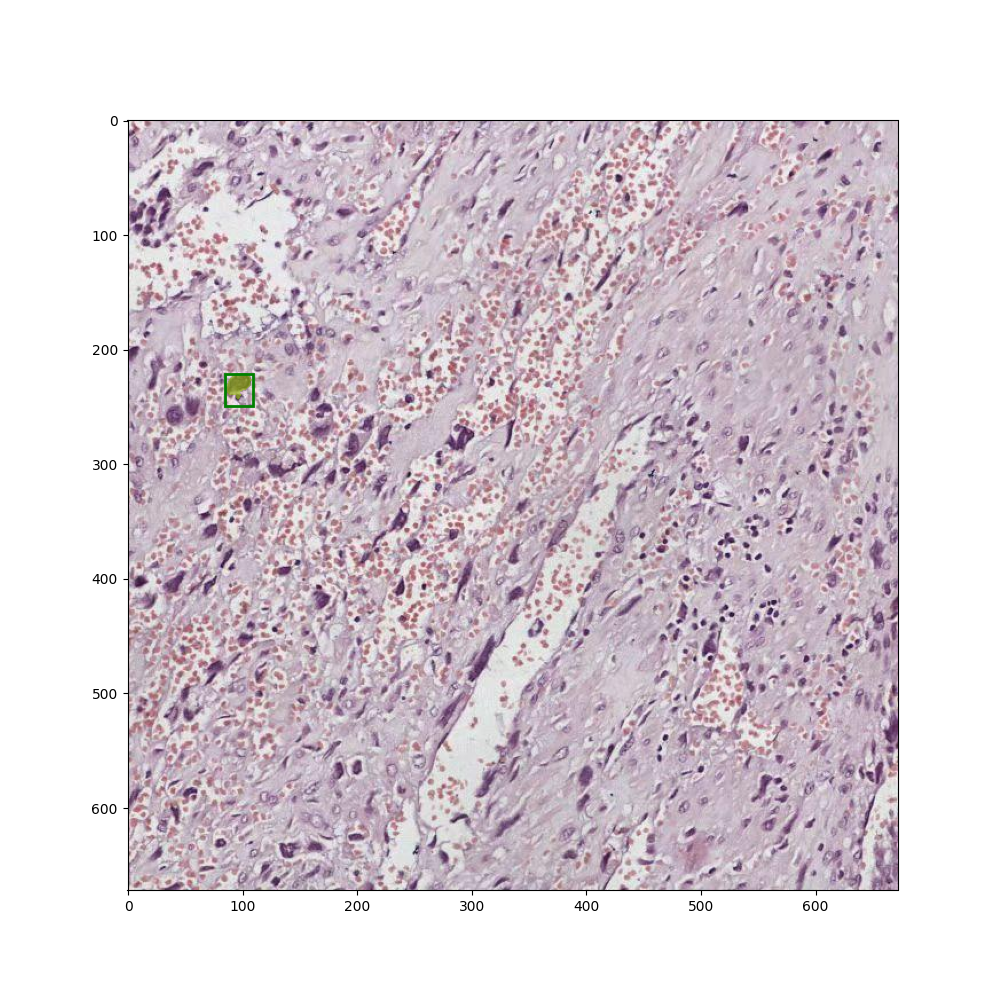
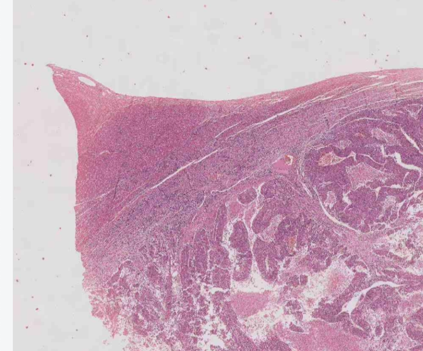
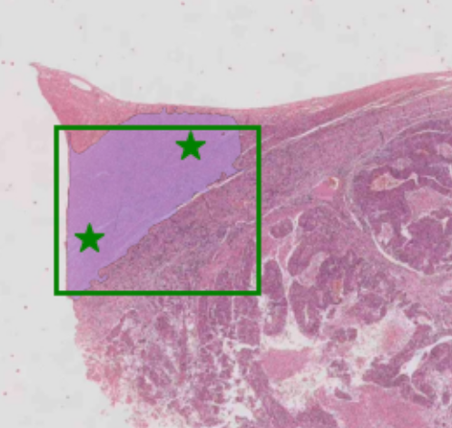

# mdi-ml-sam
MDI标注平台 SAM实时识别server⚡️。
当前支持:
- 1.🌟实时标注:多点标注，单矩形标注.
- 2.🔥带不同positive和negative的prompt.
- 3.🐬wsgi识别(框标注)

[point模式](#1.keypoints)

   
  
  

  <strong>(2) rectangle模式</strong>

  
  
  
  <strong>(3) wsgi标注</strong>

  
  
  
  

## 支持模型:
  - 1.**[Meta原生SAM](https://github.com/facebookresearch/segment-anything)** (服务默认)
  - 2.**[mobile_sam](https://github.com/ChaoningZhang/MobileSAM)**
  - 3.**ONNX**模式
## Installation
本版本开发过程中的Python为3.10.12，请使用此版本或者更新的版本。
# [接口文档](./docs/接口文档.md)
+ 说明:请求体采用json方式，请求头中包含token进行验证 
请求头:Content-Type:application/json;token:xxxx
