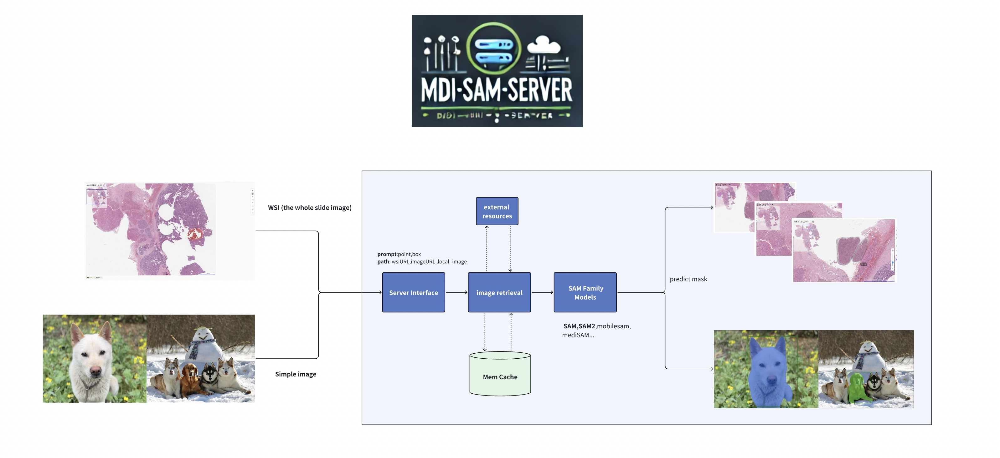

# MDI SAM Server

**[Medical Data Inteligence Lab](https://mdi.hkust-gz.edu.cn/)**

[Cheng ZHANG](https://zachczhang.github.io/)



MDI annotation platform [SAM1](https://github.com/facebookresearch/segment-anything) &  [SAM2](https://github.com/facebookresearch/segment-anything-2) (and other SAM Family models) real-time recognition server ⚡ . You can use this server to generate the mask of image that you post with points (negative, positive), box, or both. You can install the server as **label studio** machine learning backend.The service references open source projects like [Label-Studio](https://github.com/HumanSignal/label-studio), [playgroud](https://github.com/open-mmlab/playground/tree/main), [SAM](https://github.com/facebookresearch/segment-anything-2).

**Currently support:**

- (1) Real time annotation: multi-point annotation, single rectangle annotation
- (2) Prompt with different positive and negative values
- (3) the Whole Slide Image recognition


### WSI segmentation annotation


### point & rectangle模式

<p float="left">
  <br>
  
  
  <br>
   
</p>

### Supporting models:

  - 1.**[Meta SAM](https://github.com/facebookresearch/segment-anything)**
  - 2.**[Meta SAM2](https://github.com/facebookresearch/segment-anything-2)** 
  - 3.**[mobile_sam](https://github.com/ChaoningZhang/MobileSAM)**
  - 4.**ONNX** mode

### Installation

The Python used in the development process of this version is 3.10. Please use this version or an updated version.
```shell
pip install -e .
```

### How to run

- Use server command
```shell
SAM_CHOICE=SAM2 \
SAM2_CHECKPOINT=./models/sam2_hiera_base_plus.pt \
SAM2_CONFIG=sam2_hiera_b+.yaml  \
mdi_sam_server run --port 9011 --log-level INFO --env-path /home/mdi/zhangcheng-dev/mdi-sam-server/.env

# Parameter explanation:
# SAM_CHOICE: SAM model type chioce
# SAM2_CHECKPOINT: SAM model checkpoint
# SAM2_CONFIG: SAM2 config
# --env-path: enviroment value config
#...

```

- Use shell
```shell
cd src/
SAM_DRAW_MODE=true \
SAM_CHOICE=SAM2 \
SAM2_CHECKPOINT=../models/sam2_hiera_large.pt \
SAM2_CONFIG=sam2_hiera_l.yaml \
python run_server.py run  --port 9014 --log-level INFO --env-path
```

### [API Docs](./docs/api.md)

+ Explanation: The request body adopts JSON mode, and the request header contains a token for verification
Request header: Content Type: application/JSON; token:xxxx
